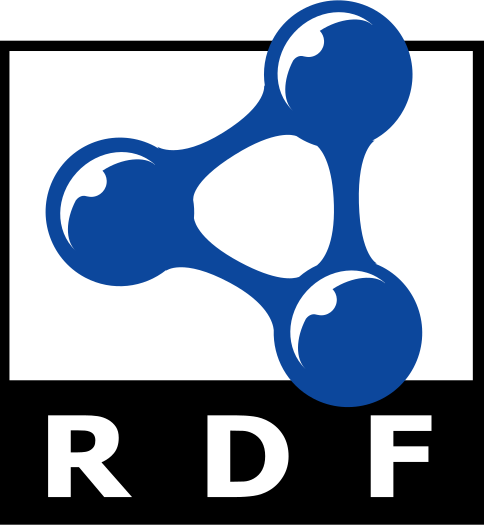

<p align="center">
  
</p>

<h1 align="center">semanticlint</h1>

<p align="center">
  Extensible linter and quality pipeline for RDF, SKOS, OWL and RDFS vocabularies.
</p>

<p align="center">
  <a href="https://pypi.org/project/semanticlint/"></a>
  <a href="https://github.com/gbelbe/semanticlint/actions"></a>
  <a href="https://opensource.org/licenses/MIT"></a>
</p>

---

## Features

- **Stage 1 — Lint**: syntax validation for Turtle, RDF/XML, N-Triples, JSON-LD
- **Stage 2 — Integrity**: SKOS integrity conditions (W3C), OWL consistency, RDFS checks
- **Stage 3 — Quality**: label coverage, definition coverage, hierarchy metrics
- **Auto-detection**: identifies SKOS / OWL / RDFS / RDF vocabulary types automatically
- **Extensible**: add custom checks with a single class and `@CheckRegistry.register`
- **Configurable**: `onto-ci.yml` alongside your vocabulary files controls which stages run

## Installation

```bash
pip install semanticlint
```

## Quick start

```bash
semanticlint check my-taxonomy.ttl
semanticlint check vocabularies/ --select SKO --ignore SKO003
```

## Writing a custom check

```python
from semanticlint import Check, CheckRegistry, VocabType, Severity, Violation
from rdflib import RDF
from rdflib.namespace import SKOS

@CheckRegistry.register
class CamelCaseConceptCheck(Check):
    id          = "CUS001"
    description = "Concept local names should be CamelCase"
    severity    = Severity.WARNING
    applies_to  = VocabType.SKOS

    def run(self, graph, config):
        violations = []
        for concept in graph.subjects(RDF.type, SKOS.Concept):
            local = str(concept).split("#")[-1].split("/")[-1]
            if not local[0].isupper():
                violations.append(Violation(self.id, f"{local} is not CamelCase", self.severity, concept))
        return violations
```

## Configuration (`onto-ci.yml`)

```yaml
version: 1
sources: ["*.ttl", "vocabularies/**/*.ttl"]

select: ["RDF", "SKO", "QUA"]
ignore: []

quality:
  min_label_coverage: 1.0
  min_definition_coverage: 0.5
  languages: ["en"]

plugins:
  - my_project.custom_checks
```

## License

MIT — logo is public domain (W3C RDF logo via Wikimedia Commons).
