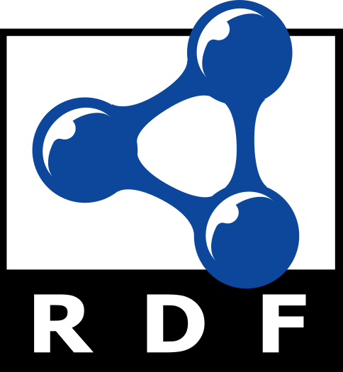

<p align="center">
  
</p>

<h1 align="center">semanticlint</h1>

<p align="center">
  Extensible linter and quality pipeline for RDF, SKOS, OWL and RDFS vocabularies.
</p>

<p align="center">
  <a href="https://pypi.org/project/semanticlint/"></a>
  <a href="https://github.com/gbelbe/semanticlint/actions"></a>
  <a href="https://codecov.io/gh/gbelbe/semanticlint"></a>
  <a href="https://github.com/astral-sh/ruff"></a>
  <a href="https://opensource.org/licenses/MIT"></a>
</p>

---

## Features

- **Stage 1 — Lint**: syntax validation for Turtle, RDF/XML, N-Triples, JSON-LD
- **Stage 2 — Integrity**: SKOS integrity conditions (W3C), OWL consistency, RDFS checks
- **Stage 3 — Quality**: label coverage, definition coverage, hierarchy metrics
- **Auto-detection**: identifies SKOS / OWL / RDFS / RDF vocabulary types automatically
- **Extensible**: add custom checks with a single class and `@CheckRegistry.register`
- **Configurable**: `onto-ci.yml` alongside your vocabulary files controls which stages run

## Why semanticlint, and how it relates to SHACL / pySHACL

**Decision: semanticlint is the aggregation layer; [pySHACL](https://github.com/RDFLib/pySHACL) is
the SHACL engine underneath it.** Shape-based, per-node constraints (a class must have an
`rdfs:label`, a property must declare `rdfs:domain`/`rdfs:range`, SKOS label disjointness, …) are
expressed as SHACL shapes and validated through pySHACL — the W3C-standard, reusable way to do it.
semanticlint does **not** reimplement what SHACL already does well.

**Objective: aggregate, under one tool and one report, the validations and metrics that SHACL
_cannot_ express on its own.** SHACL validates one node against a shape and answers *pass / fail per
node*. It is not designed for **statistical, graph-wide or hierarchy-scoped quality** — questions like:

- *What fraction of classes carry a label?* (coverage metrics, not per-node constraints)
- *What is the label/definition coverage of the `Animal` **subtree**, and does it meet a threshold that
  varies by hierarchy level* (1st-order class, 2nd-order class, …)?
- Rolling many heterogeneous signals — SHACL shape results, aggregate metrics, and imperative
  Python checks — into a single severity-graded report with `fail-on` gating for CI.

This limitation of SHACL for aggregate data-quality assessment is documented in the literature —
see *“Is SHACL Suitable for Data Quality Assessment?”* (arXiv, 2025):
<https://arxiv.org/html/2507.22305v2>. semanticlint exists to cover precisely that gap: it runs SHACL
where SHACL fits, and adds coverage metrics, hierarchy-scoped aggregation with per-level thresholds,
auto vocabulary detection, curated rule sets, and unified reporting on top.

### Scope of the two tools

| Capability | pySHACL (SHACL engine) | semanticlint (aggregation layer) |
|---|:---:|:---:|
| Per-node shape constraints (`sh:minCount`, domain/range, datatypes, disjointness) | ✅ | ✅ *(via pySHACL)* |
| Severity per result (`sh:Violation`/`Warning`/`Info`) | ✅ | ✅ |
| **Aggregate coverage metrics** (e.g. *% of classes labelled*) | ❌ | ✅ |
| **Hierarchy-scoped metrics** (per class/subtree) with **per-level thresholds** | ❌ | ✅ |
| Imperative / custom Python checks alongside shapes | ❌ | ✅ |
| Auto-detect SKOS / OWL / RDFS / RDF and select applicable checks | ❌ | ✅ |
| Curated, ready-made OWL / SKOS / RDFS / URI rule sets | ❌ *(you author every shape)* | ✅ |
| Unified report + `fail-on` gating for CI across all of the above | ❌ | ✅ |

**Rule of thumb:** if a rule is a per-node constraint, write it as a SHACL shape (pySHACL runs it). If
it is an aggregate, a hierarchy-scoped metric, or needs to sit in one graded report with everything
else, that is what semanticlint adds.

## Installation

```bash
pip install semanticlint
```

## Quick start

```bash
semanticlint check my-taxonomy.ttl
semanticlint check vocabularies/ --select SKO --ignore SKO003
```

## Project-specific rules (`*.shapes.ttl`)

Rules that are specific to **your** ontology — business constraints the built-in checks can't know
about — live in a plain SHACL file committed **next to the vocabulary it constrains**. semanticlint
**auto-discovers** any `*.shapes.ttl` file (a sibling when you check a single file, the whole tree
when you check a directory), unions it with the built-in shapes, and enforces it. No configuration,
no registration.

Say `zoo.ttl` defines a zoo ontology. Drop a `zoo.shapes.ttl` beside it:

```turtle
# zoo.shapes.ttl — versioned in git next to zoo.ttl
@prefix sh: <http://www.w3.org/ns/shacl#> .
@prefix ex: <http://example.org/zoo#> .

ex:PersonEmploymentShape a sh:NodeShape ;
    sh:targetClass ex:Person ;
    sh:property [ sh:path ex:work_for ;
                  sh:class ex:Department ;
                  sh:maxCount 1 ;
                  sh:message "A Person may work_for at most one Department" ] .
```

```bash
semanticlint check zoo/
#   ERROR   [PersonEmploymentShape] alice: A Person may work_for at most one Department
# 1 violation: 1 error  (fail-on: error)   → exit code 1, CI fails
```

Notes:

- **No annotations needed.** The violation's id defaults to the shape's name
  (`PersonEmploymentShape`); set a custom one with `slint:checkId "ZOO001"` if you want it stable for
  `--select`/`--ignore`.
- **Severity & CI gating.** A plain shape reports at SHACL's default `sh:Violation` → **error**, so it
  fails CI under the default `--fail-on error`. Use `sh:severity sh:Warning`/`sh:Info` to soften it.
- **Shapes files are never linted as data** — a `*.shapes.ttl` is treated as rules, not as a
  vocabulary to check.
- **Targets do the gating**, so a local shape only fires on the nodes it targets — it's safe to keep
  shared shapes for several vocabularies in one directory.

## Writing a custom check

```python
from semanticlint import Check, CheckRegistry, VocabType, Severity, Violation
from rdflib import RDF
from rdflib.namespace import SKOS

@CheckRegistry.register
class CamelCaseConceptCheck(Check):
    id          = "CUS001"
    description = "Concept local names should be CamelCase"
    severity    = Severity.WARNING
    applies_to  = VocabType.SKOS

    def run(self, graph, config):
        violations = []
        for concept in graph.subjects(RDF.type, SKOS.Concept):
            local = str(concept).split("#")[-1].split("/")[-1]
            if not local[0].isupper():
                violations.append(Violation(self.id, f"{local} is not CamelCase", self.severity, concept))
        return violations
```

## Configuration (`onto-ci.yml`)

```yaml
version: 1
sources: ["*.ttl", "vocabularies/**/*.ttl"]

select: ["RDF", "SKO", "QUA"]
ignore: []

quality:
  min_label_coverage: 1.0
  min_definition_coverage: 0.5
  languages: ["en"]

plugins:
  - my_project.custom_checks
```

## License

MIT — logo is public domain (W3C RDF logo via Wikimedia Commons).
